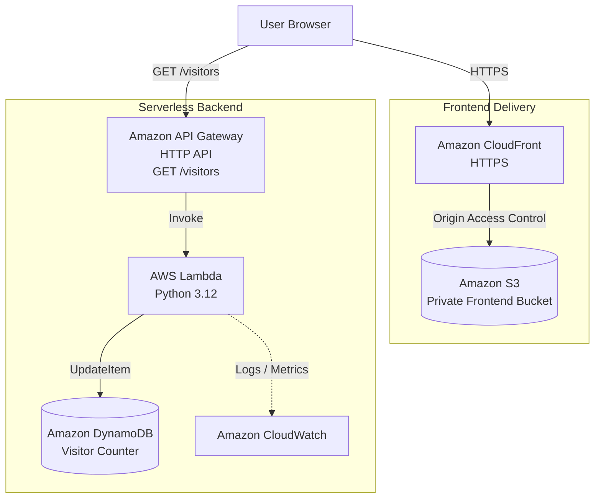

# Cloud Resume Platform

[](https://github.com/bilge26/cloud-resume-platform/actions/workflows/ci.yml)
[](https://github.com/bilge26/cloud-resume-platform/actions/workflows/deploy.yml)

A cloud and DevOps portfolio project built to demonstrate **Infrastructure as Code, serverless architecture, automated testing, CI/CD, cloud security, and observability** using AWS, Terraform, Python, and GitHub Actions.

> **Project status:** Live on AWS. Infrastructure is managed with Terraform, and frontend changes are automatically deployed through GitHub Actions using OIDC-based AWS authentication.

## Live Demo

The application is publicly available through Amazon CloudFront:

**[View Live Cloud Resume](https://d3ixm97gov238k.cloudfront.net)**

## Why this project?

My professional experience includes Kubernetes, infrastructure automation, VMware Aria Automation, Ansible, Argo Workflows, and event-driven backend systems.

This project extends that background into public-cloud engineering by focusing on:

- AWS serverless services
- Terraform-based Infrastructure as Code
- GitHub Actions CI/CD
- IAM and least-privilege access
- GitHub OIDC authentication
- Automated backend testing
- Remote Terraform state
- Cloud monitoring and cost controls
- Cloud-native application delivery

## Architecture



The frontend is served through CloudFront while the underlying S3 bucket remains private.

The visitor counter is implemented as a serverless API using API Gateway, AWS Lambda, and DynamoDB.

A more detailed architecture view, including IAM, CI/CD, OIDC authentication, remote Terraform state, and monitoring, is available in [`docs/architecture.md`](docs/architecture.md).

## Current Implementation

### Frontend

- Responsive static resume and portfolio website
- Experience, technical skills, and projects sections
- Live visitor counter integrated with the AWS backend
- Hosted in a private Amazon S3 bucket
- Delivered publicly through Amazon CloudFront
- HTTPS enabled through CloudFront
- S3 access restricted through CloudFront Origin Access Control (OAC)
- S3 server-side encryption enabled
- S3 object versioning enabled
- Public S3 access blocked

### Backend

- Python AWS Lambda visitor-counter function
- Amazon DynamoDB table using `PAY_PER_REQUEST`
- Atomic visitor-counter increment using DynamoDB `UpdateItem`
- Amazon API Gateway HTTP API
- Public endpoint:

```text
GET /visitors
```

- Lambda environment configuration managed through Terraform
- API Gateway CORS restricted to approved frontend origins

### IAM and Security

The application follows a least-privilege approach.

The Lambda execution role can:

- Write execution logs to CloudWatch
- Perform `dynamodb:UpdateItem` only on the visitor-counter table

API Gateway receives permission to invoke the Lambda function.

The frontend deployment IAM role can:

- List the frontend S3 bucket
- Upload, retrieve, and delete frontend objects
- Create CloudFront invalidations

The GitHub deployment role does not receive administrator access.

No long-lived AWS access keys are stored in GitHub.

## Testing

The Lambda handler is covered by unit tests using a mocked DynamoDB table, so backend tests do not require access to live AWS infrastructure.

Run locally:

```bash
python -m unittest discover -s backend/tests -v
```

The tests verify both the Lambda response and the parameters used in the DynamoDB atomic update operation.

## Continuous Integration

GitHub Actions runs CI checks on pushes and pull requests targeting `main`.

The CI workflow performs:

1. Repository checkout
2. Python 3.12 setup
3. Dependency installation
4. Backend unit tests
5. Terraform setup
6. `terraform fmt -check`
7. `terraform init -backend=false`
8. `terraform validate`

The CI workflow validates application and infrastructure code without deploying AWS resources.

## Continuous Deployment

Frontend deployment is handled by a separate GitHub Actions workflow.

When frontend changes are pushed to `main`:

```text
Git Push
   ↓
GitHub Actions
   ↓
GitHub OIDC
   ↓
AWS STS
   ↓
Least-Privilege IAM Role
   ↓
S3 Sync
   ↓
CloudFront Invalidation
   ↓
Live Website
```

GitHub authenticates to AWS using OpenID Connect (OIDC).

AWS STS issues temporary credentials after validating the GitHub OIDC token, so permanent AWS access keys are not stored in repository secrets.

The deployment workflow:

- Synchronizes `frontend/` with the private S3 bucket
- Removes obsolete frontend objects
- Creates a CloudFront invalidation so updated content is delivered immediately

## Infrastructure as Code

AWS infrastructure is managed using Terraform.

Terraform provisions and manages:

- Amazon S3
- Amazon CloudFront
- Amazon API Gateway
- AWS Lambda
- Amazon DynamoDB
- AWS IAM roles and policies
- Amazon CloudWatch monitoring

Infrastructure changes are reviewed using:

```bash
terraform -chdir=terraform plan
```

before being applied.

## Terraform Remote State

Terraform state is stored remotely in a dedicated private S3 bucket rather than only on a local development machine.

The state bucket has:

- Public access blocked
- Server-side encryption
- Versioning enabled
- Terraform state locking
- Protection against accidental Terraform destruction

The Terraform state bucket is separate from the frontend S3 bucket.

## Monitoring

AWS Lambda execution logs are available through Amazon CloudWatch Logs.

A CloudWatch metric alarm monitors Lambda execution errors, providing basic observability for the visitor-counter backend.

## Cost Controls

An AWS Budget is configured to provide notifications when account spending approaches or exceeds the configured monthly threshold.

The budget provides cost alerts but does not automatically stop AWS resources.

## Technology Stack

| Area | Technologies |
| --- | --- |
| Cloud | AWS |
| Infrastructure as Code | Terraform |
| Frontend | HTML, CSS, JavaScript |
| Frontend storage | Amazon S3 |
| Content delivery | Amazon CloudFront |
| Backend | Python, AWS Lambda |
| API | Amazon API Gateway HTTP API |
| Database | Amazon DynamoDB |
| Logging / Monitoring | Amazon CloudWatch |
| Terraform state | Amazon S3 Remote Backend |
| Continuous Integration | GitHub Actions |
| Continuous Deployment | GitHub Actions |
| AWS authentication for CD | GitHub OIDC, AWS STS |
| Access control | AWS IAM |
| Version control | Git, GitHub |

## Repository Structure

```text
cloud-resume-platform/
├── .github/
│   └── workflows/
│       ├── ci.yml
│       └── deploy.yml
│
├── backend/
│   ├── lambda_function.py
│   ├── requirements.txt
│   └── tests/
│       └── test_lambda.py
│
├── docs/
│   ├── architecture.md
│   └── architecture.mmd
│
├── frontend/
│   ├── index.html
│   ├── script.js
│   └── style.css
│
├── terraform/
│   ├── api_gateway.tf
│   ├── cloudfront.tf
│   ├── dynamodb.tf
│   ├── iam.tf
│   ├── lambda.tf
│   ├── monitoring.tf
│   ├── outputs.tf
│   ├── providers.tf
│   ├── s3.tf
│   ├── state.tf
│   └── variables.tf
│
├── .gitignore
├── .terraform.lock.hcl
└── README.md
```

## Local Development

### Frontend

Run the frontend locally:

```bash
cd frontend
python3 -m http.server 8000
```

Then open:

```text
http://localhost:8000
```

The local development origin is allowed by the API Gateway CORS configuration.

### Backend Tests

```bash
python -m unittest discover -s backend/tests -v
```

### Terraform

Format the configuration:

```bash
terraform -chdir=terraform fmt
```

Validate it:

```bash
terraform -chdir=terraform validate
```

Review infrastructure changes:

```bash
AWS_PROFILE=cloud-resume terraform -chdir=terraform plan
```

Apply reviewed infrastructure changes:

```bash
AWS_PROFILE=cloud-resume terraform -chdir=terraform apply
```

AWS authentication is performed using temporary credentials rather than long-lived root access keys.

## Security and Infrastructure Decisions

- **Private frontend bucket:** direct public access to the frontend S3 bucket is blocked.
- **CloudFront OAC:** CloudFront securely retrieves frontend objects from the private S3 origin.
- **HTTPS delivery:** users access the application through CloudFront over HTTPS.
- **Encryption:** S3 server-side encryption is enabled.
- **Versioning:** frontend and Terraform state buckets use versioning.
- **Least privilege:** Lambda receives only the DynamoDB permission required by the application.
- **Restricted deployment role:** GitHub Actions can modify only the resources required for frontend deployment.
- **OIDC authentication:** GitHub Actions uses temporary AWS credentials instead of stored access keys.
- **Configuration over hard-coding:** the DynamoDB table name is injected into Lambda through an environment variable.
- **Atomic counter update:** DynamoDB increments the visitor counter atomically rather than using a read-then-write flow.
- **Restricted CORS:** API Gateway accepts browser requests only from approved frontend origins.
- **Remote state:** Terraform state is stored in a dedicated private S3 backend with versioning and locking.

## Roadmap

- [x] Create responsive resume frontend
- [x] Define AWS infrastructure with Terraform
- [x] Implement Lambda visitor counter
- [x] Add DynamoDB persistence
- [x] Expose backend through API Gateway
- [x] Configure least-privilege IAM permissions
- [x] Add backend unit tests
- [x] Add GitHub Actions CI
- [x] Deploy infrastructure to AWS
- [x] Connect frontend to the live API
- [x] Deliver the private S3 frontend through CloudFront
- [x] Restrict API CORS to approved frontend origins
- [x] Configure GitHub OIDC authentication
- [x] Automate frontend deployment and CloudFront invalidation
- [x] Move Terraform state to a remote S3 backend
- [x] Add CloudWatch monitoring
- [x] Add AWS cost budget alerts
- [ ] Add a custom domain and DNS (optional)

## Learning Goals

- Translating infrastructure requirements into Terraform
- Understanding Terraform providers, resources, state, and backends
- Building and testing a serverless API
- Understanding IAM trust and permission boundaries
- Applying least-privilege access controls
- Separating application code from environment configuration
- Automating testing and infrastructure validation with CI
- Deploying frontend changes automatically with CD
- Authenticating GitHub Actions to AWS through OIDC
- Operating AWS infrastructure without storing long-lived cloud credentials

## Author

**Bilge Yildirim**  
Software Engineer | Platform & Infrastructure Automation

- GitHub: [bilge26](https://github.com/bilge26)
- LinkedIn: [Bilge Yildirim](https://www.linkedin.com/in/bilgey%C4%B1ld%C4%B1r%C4%B1m)