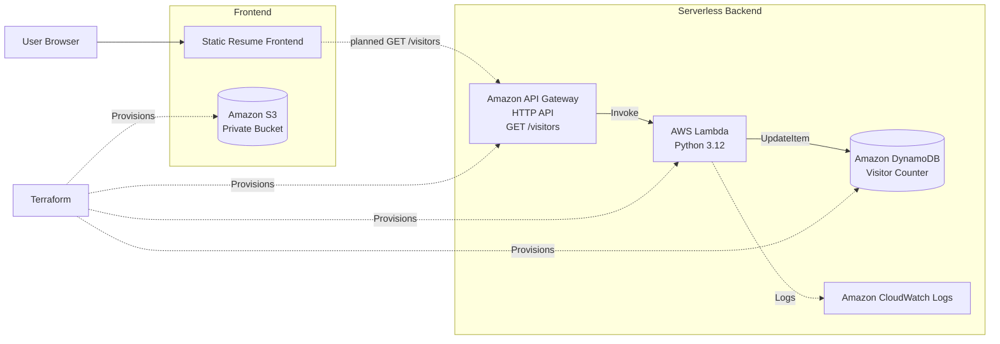

# Cloud Resume Platform

[](https://github.com/bilge26/cloud-resume-platform/actions/workflows/ci.yml)

A cloud and DevOps portfolio project built to demonstrate **Infrastructure as Code, serverless architecture, automated testing, and CI/CD practices** using AWS, Terraform, Python, and GitHub Actions.

> **Project status:** In development. The application code, serverless backend definitions, and CI pipeline are in place. AWS deployment is the next milestone.

## Why this project?

My professional experience includes Kubernetes, infrastructure automation, VMware Aria Automation, Ansible, Argo Workflows, and event-driven backend systems. This project extends that background into public-cloud engineering by focusing on:

- AWS serverless services
- Terraform-based Infrastructure as Code
- GitHub Actions CI/CD
- IAM and least-privilege access
- Automated backend testing
- Cloud-native application delivery

## Architecture

The current Terraform configuration defines a private frontend bucket and a serverless visitor-counter backend.



A more detailed architecture view, including CI and the target delivery flow, is available in [`docs/architecture.md`](docs/architecture.md).

## Current implementation

### Frontend

- Responsive static resume/portfolio page
- Experience, technical skills, and projects sections
- Visitor-counter placeholder ready for API integration
- S3 bucket defined with:
  - Public access blocked
  - Server-side encryption enabled
  - Versioning enabled
  - Terraform-managed naming and tags

### Backend

- Python AWS Lambda visitor-counter function
- DynamoDB table using `PAY_PER_REQUEST`
- Atomic counter increment using DynamoDB `UpdateItem`
- API Gateway HTTP API route:
  - `GET /visitors`
- Lambda environment configuration through Terraform
- IAM permissions following least privilege:
  - Lambda can update only the visitor-counter table
  - API Gateway can invoke the Lambda function
  - Lambda basic execution role enables logging

### Testing

The Lambda handler is covered by a unit test using a mocked DynamoDB table, so the test suite does not require AWS credentials.

Run locally:

```bash
python -m unittest discover -s backend/tests -v
```

### Continuous Integration

GitHub Actions runs on pushes and pull requests targeting `main`.

The CI workflow performs:

1. Repository checkout
2. Python 3.12 setup
3. Dependency installation
4. Backend unit tests
5. Terraform setup
6. `terraform fmt -check`
7. `terraform init -backend=false`
8. `terraform validate`

This allows application and infrastructure code to be validated without deploying resources.

## Technology stack

| Area | Technologies |
| --- | --- |
| Cloud | AWS |
| Infrastructure as Code | Terraform |
| Backend | Python, AWS Lambda |
| API | Amazon API Gateway HTTP API |
| Data | Amazon DynamoDB |
| Frontend hosting | Amazon S3 |
| CI/CD | GitHub Actions |
| Logging | Amazon CloudWatch Logs |
| Version control | Git, GitHub |

## Repository structure

```text
cloud-resume-platform/
├── .github/
│   └── workflows/
│       └── ci.yml
├── backend/
│   ├── lambda_function.py
│   ├── requirements.txt
│   └── tests/
│       └── test_lambda.py
├── docs/
│   └── architecture.md
├── frontend/
│   ├── index.html
│   ├── script.js
│   └── style.css
├── terraform/
│   ├── api_gateway.tf
│   ├── dynamodb.tf
│   ├── iam.tf
│   ├── lambda.tf
│   ├── outputs.tf
│   ├── providers.tf
│   ├── s3.tf
│   └── variables.tf
├── .gitignore
└── README.md
```

## Local development

### Frontend

Run the frontend locally:

```bash
cd frontend
python3 -m http.server 8000
```

Then open:

```text
http://localhost:8000
```

### Terraform validation

Initialize Terraform:

```bash
terraform -chdir=terraform init
```

Format configuration:

```bash
terraform -chdir=terraform fmt
```

Validate configuration:

```bash
terraform -chdir=terraform validate
```

> `terraform apply` is intentionally not part of the local setup instructions yet. Deployment configuration will be added once the AWS environment is ready.

## Security and infrastructure decisions

- **Private S3 bucket:** direct public access is blocked.
- **Encryption:** S3 server-side encryption is enabled.
- **Versioning:** frontend objects are versioned.
- **Least privilege:** the Lambda IAM policy grants only `dynamodb:UpdateItem` on the visitor-counter table.
- **Configuration over hard-coding:** the DynamoDB table name is injected into Lambda through an environment variable.
- **Atomic counter update:** DynamoDB increments the counter atomically rather than using a read-then-write flow.
- **No AWS credentials in CI:** the current CI pipeline performs tests and Terraform validation only.

## Roadmap

- [x] Create responsive resume frontend
- [x] Define S3 infrastructure with Terraform
- [x] Implement Lambda visitor counter
- [x] Add DynamoDB table
- [x] Add API Gateway HTTP API
- [x] Add least-privilege IAM configuration
- [x] Add backend unit tests
- [x] Add GitHub Actions CI
- [ ] Deploy infrastructure to AWS
- [ ] Connect frontend visitor counter to the live API
- [ ] Add CloudFront in front of the private S3 bucket
- [ ] Configure GitHub Actions deployment using OIDC and an AWS IAM role
- [ ] Add CloudWatch monitoring/alarm configuration
- [ ] Add custom domain and HTTPS if needed
- [ ] Add architecture screenshots and final deployment notes

## Learning goals

- Translating infrastructure requirements into Terraform
- Understanding IAM trust and permission boundaries
- Building and testing a serverless API
- Separating code from environment configuration
- Automating validation with CI
- Deploying to AWS without storing long-lived cloud credentials in GitHub

## Author

**Bilge Yildirim**  
Software Engineer | Platform & Infrastructure Automation

- GitHub: [bilge26](https://github.com/bilge26)
- LinkedIn: [Bilge Yildirim](https://www.linkedin.com/in/bilgey%C4%B1ld%C4%B1r%C4%B1m)
