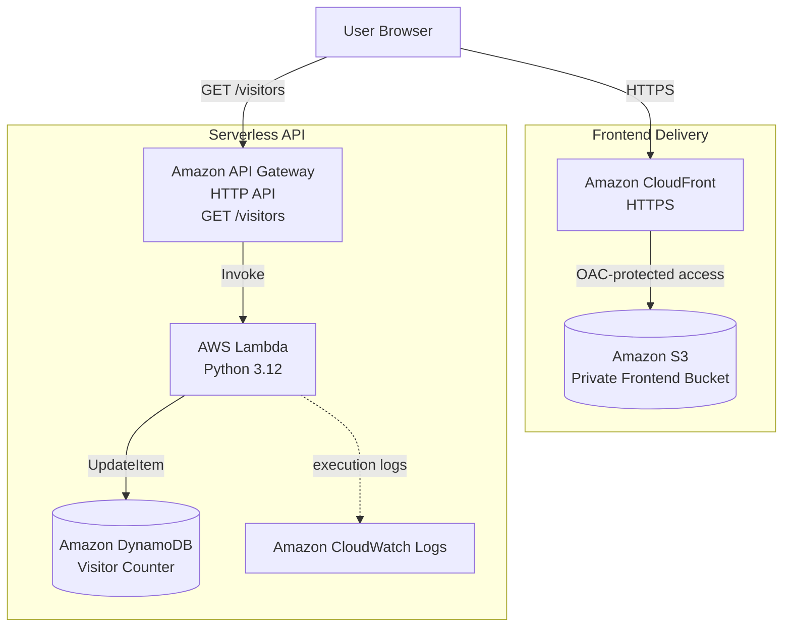
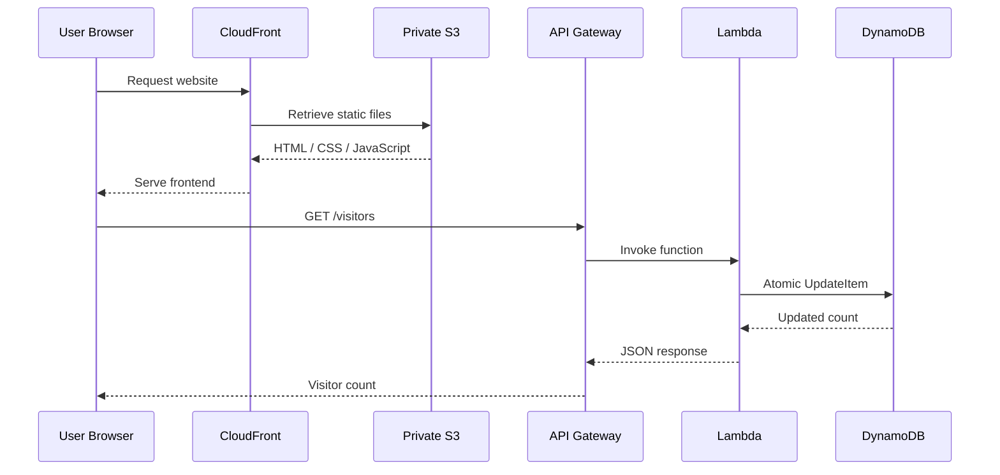
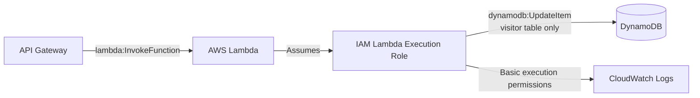
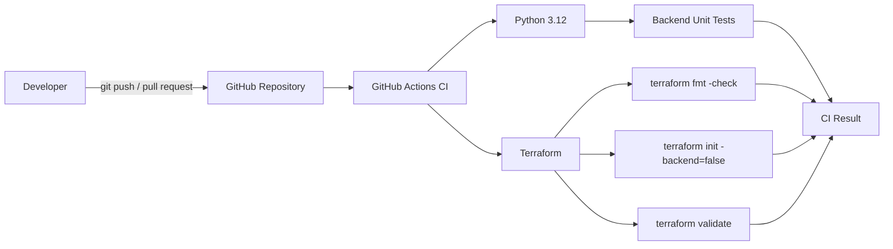
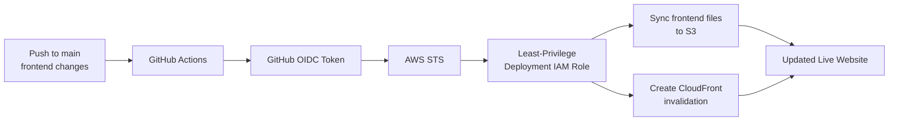
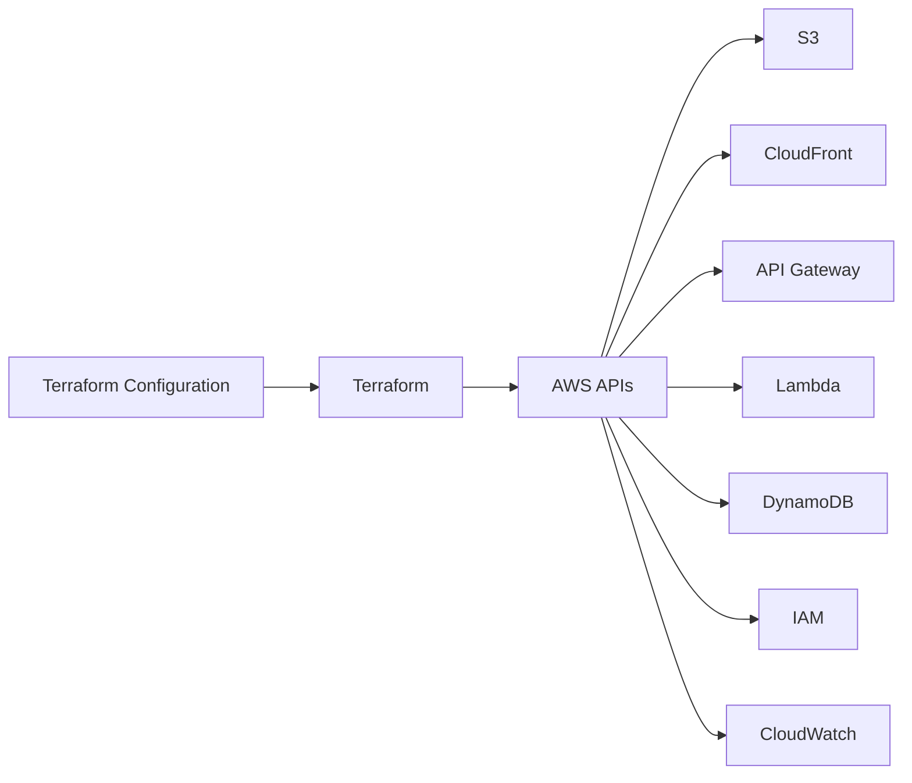
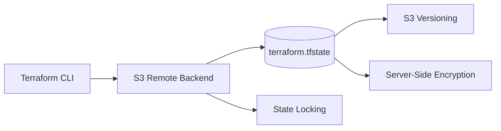
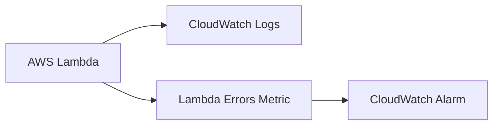

# Architecture

This document describes the deployed architecture of the Cloud Resume Platform, including the serverless application, infrastructure management, CI/CD workflows, security model, remote Terraform state, and monitoring.

## 1. Deployed Architecture

The frontend is served through Amazon CloudFront while the underlying S3 bucket remains private. The visitor counter is implemented as a serverless API using API Gateway, AWS Lambda, and DynamoDB.

## 2. Runtime Request Flow

When a user opens the live Cloud Resume:

1. The browser requests the website through Amazon CloudFront.
2. CloudFront retrieves the static HTML, CSS, and JavaScript files from the private S3 bucket using Origin Access Control (OAC).
3. The frontend JavaScript sends a `GET /visitors` request to Amazon API Gateway.
4. API Gateway invokes the visitor-counter Lambda function.
5. Lambda performs an atomic `UpdateItem` operation on the DynamoDB visitor-counter record.
6. DynamoDB returns the updated counter value.
7. Lambda returns the count as JSON.
8. API Gateway returns the response to the browser.
9. The frontend displays the updated visitor count.

## 3. Security and IAM Model

The platform follows a least-privilege approach for application and deployment permissions.

### Lambda Execution Role

The Lambda execution role does not receive broad DynamoDB permissions. Its custom policy is scoped to `dynamodb:UpdateItem` on the visitor-counter table.

API Gateway receives a separate Lambda resource permission allowing it to invoke the visitor-counter function.

### S3 and CloudFront

The frontend S3 bucket:

- Blocks all public access.
- Uses server-side encryption.
- Has versioning enabled.
- Can be read by the CloudFront distribution through Origin Access Control (OAC).

Users access the frontend through CloudFront rather than directly through S3.

### API CORS

API Gateway CORS is restricted to approved frontend origins, including the deployed CloudFront frontend and the local development origin.

## 4. Continuous Integration

GitHub Actions runs CI checks on pushes and pull requests targeting `main`.

The CI workflow validates application and infrastructure code without deploying infrastructure.

It performs:

- Python dependency installation
- Backend unit tests
- Terraform formatting checks
- Terraform initialization
- Terraform validation

No long-lived AWS credentials are stored in the CI workflow.

## 5. Continuous Deployment

Frontend deployment is automated through a separate GitHub Actions workflow.

GitHub Actions authenticates to AWS using OpenID Connect (OIDC).

The workflow does **not** store permanent AWS access keys in GitHub. Instead:

1. GitHub generates a short-lived OIDC token.
2. AWS validates the token.
3. AWS STS allows the workflow to assume the deployment IAM role.
4. Temporary AWS credentials are issued.
5. The workflow synchronizes the frontend files to S3.
6. A CloudFront invalidation is created so updated content is delivered without waiting for the previous cached version to expire.

The deployment role is limited to the frontend S3 bucket and the CloudFront distribution required by this project.

## 6. Infrastructure as Code

AWS infrastructure is defined using Terraform.

Terraform manages resources including:

- Amazon S3
- Amazon CloudFront
- Amazon API Gateway
- AWS Lambda
- Amazon DynamoDB
- IAM roles and policies
- CloudWatch monitoring

Infrastructure changes are reviewed with `terraform plan` before being applied.

## 7. Terraform Remote State

Terraform state is stored remotely in a dedicated private S3 bucket rather than only on a local development machine.

The Terraform state bucket is:

- Private
- Encrypted
- Versioned
- Protected against accidental Terraform destruction
- Configured for state locking

This allows Terraform to maintain a reliable mapping between configuration resources and the AWS resources it manages.

The frontend bucket and Terraform state bucket are separate resources.

## 8. Observability

AWS Lambda execution logs are sent to Amazon CloudWatch Logs.

A CloudWatch metric alarm monitors the visitor-counter Lambda function for execution errors.

This provides basic visibility into runtime failures without requiring direct access to the Lambda execution environment.

## 9. Cost Controls

An AWS Budget is configured for the account to provide notifications when cloud spending approaches or exceeds the defined monthly threshold.

The budget acts as a cost alerting mechanism; it does not automatically stop AWS resources.

## 10. Technology Overview

| Layer | Technology |
| --- | --- |
| Frontend | HTML, CSS, JavaScript |
| Frontend storage | Amazon S3 |
| Content delivery | Amazon CloudFront |
| API | Amazon API Gateway HTTP API |
| Compute | AWS Lambda, Python 3.12 |
| Database | Amazon DynamoDB |
| Logging / Monitoring | Amazon CloudWatch |
| Infrastructure as Code | Terraform |
| Terraform state | Amazon S3 Remote Backend |
| Continuous Integration | GitHub Actions |
| Continuous Deployment | GitHub Actions |
| AWS authentication for CD | GitHub OIDC + AWS STS |
| Access control | AWS IAM |

## 11. Optional Future Improvements

The core platform is deployed and operational. Remaining enhancements are optional:

- Custom domain and DNS
- Custom TLS certificate through AWS Certificate Manager
- Additional CloudWatch alarms and dashboards
- More extensive backend test coverage
- Separate development and production environments