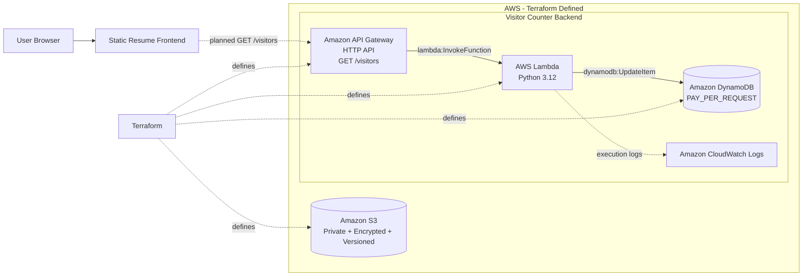
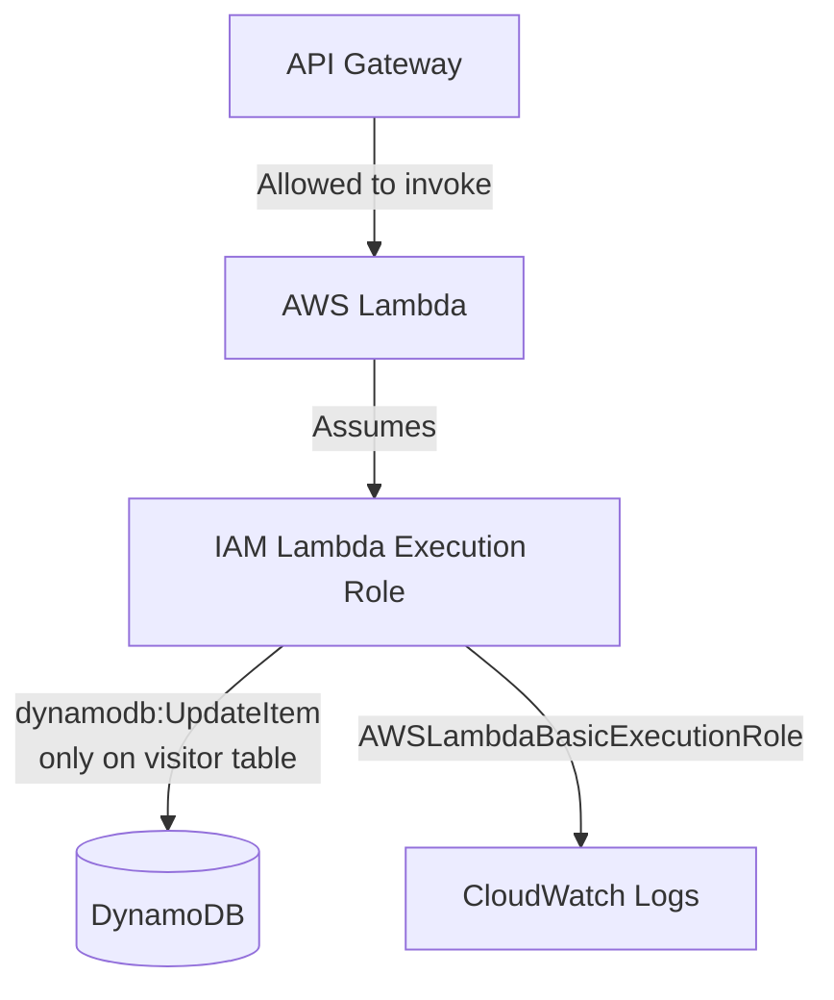
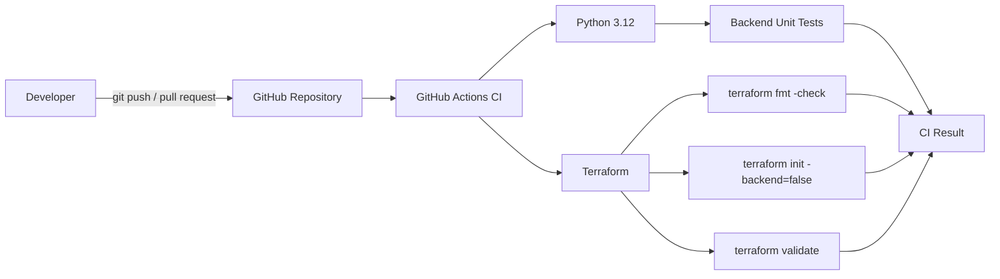
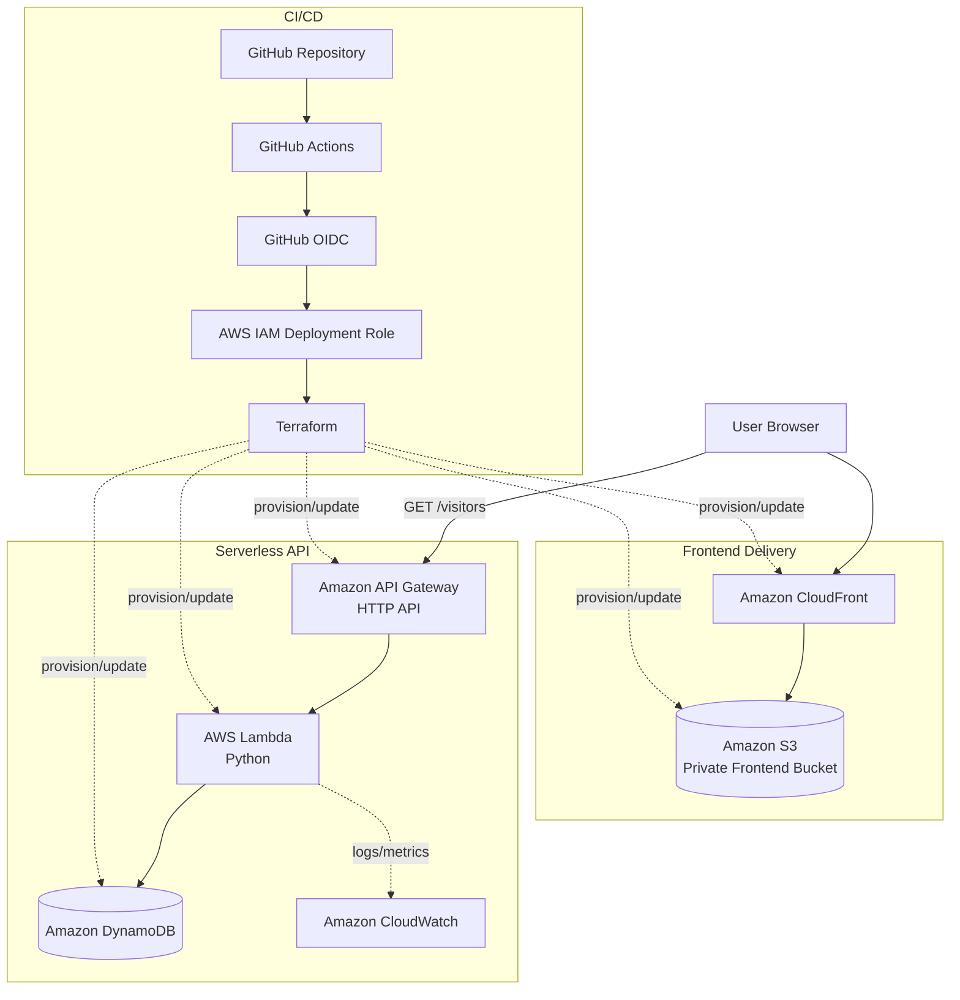

# Architecture

This document describes the architecture of the Cloud Resume Platform and separates the **current Terraform-defined architecture** from the **target deployment architecture**.

## 1. Current serverless architecture

### Intended runtime request flow

Once the frontend is wired to the live API:

1. The user opens the resume frontend.
2. The frontend calls `GET /visitors`.
3. API Gateway proxies the request to the Lambda function.
4. Lambda performs an atomic `UpdateItem` operation in DynamoDB.
5. DynamoDB returns the updated visitor count.
6. Lambda returns the count as JSON.
7. API Gateway returns the response to the browser.

### IAM model

The Lambda function does not receive broad DynamoDB access. Its inline policy is scoped to `dynamodb:UpdateItem` on the visitor-counter table.

## 2. Continuous integration

The current CI pipeline intentionally does not contain AWS credentials and does not deploy infrastructure.

## 3. Target deployment architecture

### Why CloudFront?

The S3 bucket remains private. CloudFront becomes the public delivery layer, providing HTTPS and preventing the frontend bucket from being directly exposed.

### Why GitHub OIDC?

The deployment workflow will use short-lived AWS credentials obtained through GitHub OIDC instead of storing long-lived AWS access keys in repository secrets.

## 4. Planned operational improvements

- CloudFront configuration
- GitHub OIDC trust policy and deployment role
- Deployment workflow
- CloudWatch alarms and monitoring configuration
- Frontend integration with the live API URL
- Optional custom domain and DNS

This separation keeps the repository accurate: CI and infrastructure definitions are implemented, while cloud deployment remains a clearly tracked next step.
